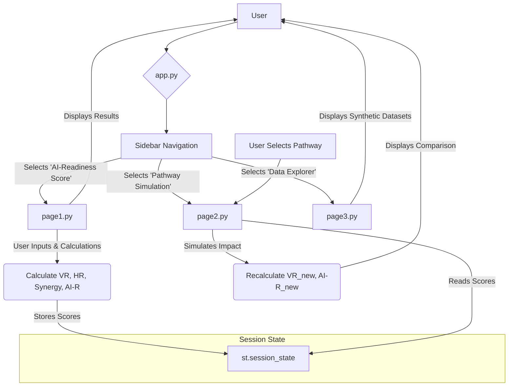
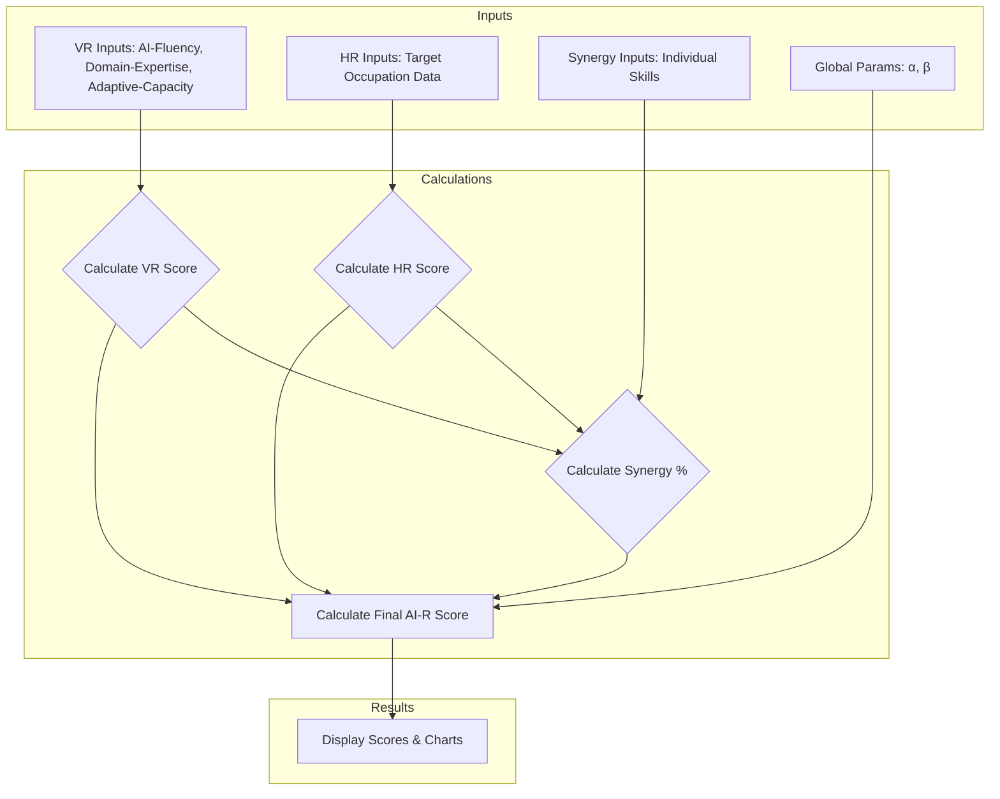

id: 68f63f38833967484a12dd31_documentation
summary: AI-Readiness score - gemini-2.5-pro Documentation
feedback link: https://docs.google.com/forms/d/e/1FAIpQLSfWkOK-in_bMMoHSZfcIvAeO58PAH9wrDqcxnJABHaxiDqhSA/viewform?usp=sf_link
environments: Web
status: Published
# AI Career Navigator & Pathway Planner Codelab

## Introduction to the AI-Readiness Framework
Duration: 05:00

In today's rapidly evolving job market, the integration of Artificial Intelligence (AI) is transforming industries and creating new career opportunities. For professionals and students, understanding their preparedness for these AI-enabled roles is crucial for effective career planning. This codelab introduces the **AI Career Navigator & Pathway Planner**, a Streamlit application built around the **AI-Readiness (AI-R) Score** framework.

The AI-R framework is a parametric model designed to quantify an individual's preparedness for an AI-centric career. It provides a holistic score by considering two primary dimensions:
1.  **Idiosyncratic Readiness ($V^R$):** An individual's personal capabilities, skills, and adaptability. This is the "supply" side of the equation.
2.  **Systematic Opportunity ($H^R$):** The external market demand and opportunities available for specific AI-related roles. This is the "demand" side.

The framework also incorporates a **Synergy** component, which measures the alignment between an individual's skills and market needs, amplifying the score when there's a strong match.

The core formula for the AI-Readiness Score is:
$$ AI-R_{i,t} = \alpha \cdot V^R_i(t) + (1-\alpha) \cdot H^R_i(t) + \beta \cdot \text{Synergy}\%(V^R, H^R) $$

Where:
-   $V^R(t)$ is the Idiosyncratic Readiness (individual capability).
-   $H^R(t)$ is the Systematic Opportunity (market demand).
-   $\alpha$ is the weight on individual vs. market factors.
-   $\beta$ is the Synergy coefficient.

This application serves as a practical implementation of the AI-R framework, allowing users to:
*   Calculate their baseline AI-Readiness Score based on a comprehensive set of inputs.
*   Perform "what-if" scenario analysis to see how different learning pathways and skill development can improve their score.
*   Explore the underlying data used for calculations.

In this codelab, you will walk through the application's structure, understand the logic behind each calculation, and learn how to use its features for strategic career planning.

<aside class="positive">
<b>What you'll learn:</b>
<ul>
    <li>The core concepts of the AI-Readiness Score framework.</li>
    <li>How to structure a multi-page Streamlit application.</li>
    <li>How individual capabilities ($V^R$) and market opportunities ($H^R$) are quantified.</li>
    <li>How to implement "what-if" scenario simulations for career pathway planning.</li>
    <li>How to use various Streamlit components for data input, calculation, and visualization.</li>
</ul>
</aside>

## Application Architecture and Setup
Duration: 10:00

Before diving into the functionalities, let's understand the application's structure and how to get it running. The application is modular, with a main entry point and separate files for each page, which is a best practice for managing larger Streamlit projects.

### File Structure

The application consists of the following files:
-   `app.py`: The main script that runs the Streamlit application. It handles the overall layout, sidebar navigation, and routing to different pages.
-   `application_pages/page1.py`: Contains the code for the "AI-Readiness Score" calculation page.
-   `application_pages/page2.py`: Contains the code for the "Pathway Simulation" page.
-   `application_pages/page3.py`: Contains the code for the "Data Explorer" page.

### Application Flow Diagram

The diagram below illustrates how a user interacts with the application and how the different modules work together.



### Main Application (`app.py`)

The `app.py` script serves as the application's orchestrator. Its primary responsibilities are:
1.  **Page Configuration:** Sets the title and layout of the app using `st.set_page_config()`.
2.  **Sidebar Setup:** Creates the sidebar, adds a logo, and includes a `selectbox` for navigation between pages.
3.  **Introduction:** Displays the introductory text and the core AI-R formula on the main screen.
4.  **Routing:** Uses an `if/elif/else` block to check the user's selection from the sidebar and calls the appropriate function (`run_page1`, `run_page2`, or `run_page3`) from the corresponding module.

```python
import streamlit as st

st.set_page_config(page_title="QuLab", layout="wide")

# Sidebar setup
st.sidebar.image("https://www.quantuniversity.com/assets/img/logo5.jpg")
st.sidebar.divider()
st.title("AI Career Navigator & Pathway Planner")
st.divider()

# Introduction text and formula
st.markdown("""...""")
st.latex(r"""...""")
st.markdown("""...""")

# Navigation routing
page = st.sidebar.selectbox(label="Navigation", options=["AI-Readiness Score", "Pathway Simulation", "Data Explorer"])

if page == "AI-Readiness Score":
    from application_pages.page1 import run_page1
    run_page1()
elif page == "Pathway Simulation":
    from application_pages.page2 import run_page2
    run_page2()
elif page == "Data Explorer":
    from application_pages.page3 import run_page3
    run_page3()
```

### Setup and Running the Application

To run this application on your local machine, follow these steps:
1.  **Prerequisites:** Ensure you have Python installed.
2.  **Create Project Directory:** Create a folder for the project and an `application_pages` subfolder within it. Place `app.py` in the main folder and the page files (`page1.py`, `page2.py`, `page3.py`) inside `application_pages`.
3.  **Install Libraries:** Open your terminal or command prompt and install the required Python libraries.

    ```console
    pip install streamlit pandas numpy plotly
    ```
4.  **Run the App:** Navigate to the project's root directory in your terminal and run the following command:

    ```console
    streamlit run app.py
    ```

Your web browser should open a new tab with the running application.

## Calculating the AI-Readiness Score
Duration: 20:00

The "AI-Readiness Score" page, handled by `page1.py`, is the core of the application. It allows users to input a wide range of data points about their skills, experience, and career goals to compute their AI-R score. The calculation is broken down into three main components: Idiosyncratic Readiness ($V^R$), Systematic Opportunity ($H^R$), and Synergy.

### Calculation Flowchart

This flowchart visualizes the step-by-step process of calculating the final AI-R score from the user's inputs.



### 1. Idiosyncratic Readiness ($V^R$) - Individual Capability

$V^R$ measures an individual's intrinsic readiness. It's a weighted average of three pillars:

-   **AI-Fluency (45%):** How proficient an individual is with AI concepts and tools.
-   **Domain-Expertise (35%):** An individual's knowledge and experience in their specific field.
-   **Adaptive-Capacity (20%):** Soft skills like flexibility, emotional intelligence, and strategic thinking.

The final $V^R$ score is calculated as:
$$ V^R = (0.45 \cdot \text{AI-Fluency}) + (0.35 \cdot \text{Domain-Expertise}) + (0.20 \cdot \text{Adaptive-Capacity}) $$

Each of these pillars is calculated from more granular inputs provided by the user through sliders and selection boxes in the UI. For instance, **AI-Fluency** is derived from technical skills, productivity gains with AI, critical judgment, and learning velocity.

### 2. Systematic Opportunity ($H^R$) - Market Demand

$H^R$ quantifies the attractiveness of the market for a chosen career path. The user selects a `Target Occupation` from a predefined list. The score is calculated based on:

-   **Base Opportunity Score ($H_{base}$):** A foundational score derived from:
    -   AI Enhancement Potential
    -   Job Growth Projection
    -   Wage Premium for AI skills
    -   Entry Accessibility (education/experience required)
-   **Growth Multiplier:** Adjusts the score based on the recent growth in job postings.
-   **Regional Multiplier:** Adjusts the score for local market demand and remote work factors.

The formula is:
$$ H^R = H_{base} \cdot \text{Growth Multiplier} \cdot \text{Regional Multiplier} $$

The user can tweak the sensitivity of the multipliers using the $\lambda$ and $\gamma$ sliders in the UI.

### 3. Synergy Percentage

Synergy captures the powerful interaction between individual readiness and market opportunity. It's high when a person's specific skills are a perfect match for a high-demand job.

It is calculated using the following formula:
$$ \text{Synergy}\% = \frac{V^R \cdot H^R \cdot \text{Alignment Factor}}{100.0} $$

The **Alignment Factor** is a critical component that depends on:
-   **Skills Match Score:** This is calculated by comparing the user's skills (editable in a data editor) with the skills required for the target occupation.
-   **Timing Factor:** This gives a slight bonus to individuals with more years of experience, reflecting their ability to better leverage opportunities.

### 4. Final AI-Readiness Score

All the components are combined using the global parameters $\alpha$ (weight on individual factors) and $\beta$ (synergy coefficient) set in the sidebar.

```python
def calculate_ai_readiness_score(vr_score, hr_score, synergy_percentage, alpha, beta):
    return alpha * vr_score + (1-alpha) * hr_score + beta * synergy_percentage
```

### Results and Visualization

After the user clicks the "Calculate" button, the results are displayed using `st.metric` for a clear, at-a-glance view. Additionally, two charts provide deeper insights:
-   A **pie chart** shows the contribution of AI-Fluency, Domain-Expertise, and Adaptive-Capacity to the total $V^R$ score.
-   A **bar chart** breaks down the components of the $H_{base}$ score, helping the user understand the market drivers for their chosen occupation.

<aside class="negative">
<b>Important:</b> The `st.session_state` is used extensively in this page to store user inputs and calculated results. This allows the values to persist across reruns and be accessible to other pages, which is crucial for the Pathway Simulation functionality.
</aside>

## Simulating Learning Pathways ("What-If" Analysis)
Duration: 15:00

The "Pathway Simulation" page, managed by `page2.py`, provides one of the most powerful features of the application: the ability to conduct "what-if" scenario analysis. Users can simulate the impact of completing a specific learning pathway on their AI-Readiness Score.

<aside class="positive">
This feature transforms the tool from a static assessment into a dynamic career planning guide, helping users make informed decisions about their professional development.
</aside>

### Pre-requisite

To run a simulation, a user must first calculate their baseline AI-R score on the "AI-Readiness Score" page. The simulation page checks if `st.session_state.vr_score` exists and is non-zero. If not, it displays a warning.

```python
if 'vr_score' not in st.session_state or st.session_state.vr_score == 0:
    st.warning("Please calculate the AI-Readiness Score on the 'AI-Readiness Score' page first.")
    return
```

### Simulation Logic

1.  **Select a Pathway:** The user chooses a learning pathway from a dropdown menu. The application uses a predefined DataFrame containing different pathways, each designed to impact the core components of Idiosyncratic Readiness ($V^R$) differently.

    ```python
    learning_pathways_df = pd.DataFrame({
        'pathway_name': ['Prompt Engineering Fundamentals', 'AI for Financial Analysis', ...],
        'pathway_type': ['AI-Fluency', 'Domain+AI Integration', ...],
        'impact_ai_fluency': [0.2, 0.1, ...],
        'impact_domain_expertise': [0.05, 0.2, ...],
        'impact_adaptive_capacity': [0.1, 0.05, ...]
    })
    ```

2.  **Set Parameters:** The user can specify their expected `Completion Score` and `Mastery Score` for the pathway using sliders. This allows for more realistic simulations (e.g., someone might only complete 80% of a course).

3.  **Simulate Impact:** When the "Simulate" button is clicked, the `simulate_pathway_impact` function is called. This function calculates the *new* AI-Fluency, Domain-Expertise, and Adaptive-Capacity scores.

    ```python
    def simulate_pathway_impact(...):
        # new_score = current_score + impact * completion * mastery
        ai_fluency = current_ai_fluency + impact_ai_fluency * completion_score * mastery_score
        domain_expertise = current_domain_expertise + impact_domain_expertise * completion_score * mastery_score
        adaptive_capacity = current_adaptive_capacity + impact_adaptive_capacity * completion_score * mastery_score
        
        # Scores are capped at 1.0
        return min(ai_fluency, 1.0), min(domain_expertise, 1.0), min(adaptive_capacity, 1.0)
    ```

### Recalculating the Scores

After simulating the impact on the $V^R$ components, the application recalculates the projected scores:
-   **New $V^R$ Score:** A new Idiosyncratic Readiness score (`vr_score_new`) is calculated using the updated component values.
-   **$H^R$ Score:** The Systematic Opportunity score remains unchanged, as undertaking a course does not change the external job market.
-   **New Synergy and AI-R Score:** The Synergy percentage and the final AI-R score are recalculated using the new $V^R$ score.

### Comparing Results

The UI is designed to clearly show the outcome of the simulation.
-   It displays the "Current" and "Projected" scores side-by-side using `st.metric`. The `delta` argument is used to highlight the change in each score.
-   A grouped bar chart provides a visual comparison of the current vs. projected AI-R, $V^R$, and $H^R$ scores, making the impact of the learning pathway easy to understand.

This immediate feedback loop allows users to experiment with different pathways and see which ones provide the most significant boost to their career readiness.

## Exploring the Application Data
Duration: 05:00

The "Data Explorer" page, implemented in `page3.py`, serves a simple but important purpose: transparency. It allows developers and curious users to view the synthetic datasets that power the application's calculations and simulations.

This page builds trust by showing the data behind the assumptions made in the model. All data is hardcoded into pandas DataFrames for this demonstration app, but in a production environment, this data would likely come from external databases or APIs.

The data is organized into several expandable sections using `st.expander`.

### Datasets Overview

1.  **Individual Profiles Data:** A sample profile containing the initial input values seen on the "AI-Readiness Score" page.
    ```python
    individual_profiles_data = {
        'user_id': [1], 'prompting_score': [0.75], 'tools_score': [0.6], ...
    }
    ```

2.  **Occupational Data:** This DataFrame contains all the market-related metrics for each target occupation. This data is used to calculate the Systematic Opportunity ($H^R$).
    ```python
    occupational_data = {
        'occupation_name': ['Data Analyst with AI Skills', ...],
        'ai_enhancement_score': [0.8, ...],
        'job_growth_rate_g': [0.25, ...], ...
    }
    ```

3.  **Learning Pathways Data:** Contains the information for the "Pathway Simulation" page, detailing how each course impacts the different components of $V^R$.
    ```python
    learning_pathways_data = {
        'pathway_name': ['Prompt Engineering Fundamentals', ...],
        'impact_ai_fluency': [0.2, ...], ...
    }
    ```
4.  **Occupation Required Skills Data:** Defines the required skills and their importance for different occupations. This is used in the Synergy calculation to determine the `skills_match_score`.
    ```python
    occupation_required_skills_data = {
        'occupation_name': ['Data Analyst with AI Skills', ...],
        'skill_name': ['Python', ...],
        'required_skill_score': [80, ...],
        'skill_importance': [0.7, ...]
    }
    ```
5.  **Individual Skills Data:** A sample of an individual's skills, which is compared against the required skills. On the main page, this data is editable via `st.data_editor`.
    ```python
    individual_skills_data = {
        'user_id': [1], 'skill_name': ['Python', ...], 'individual_skill_score': [70, ...]
    }
    ```

By exploring these datasets, a developer can fully understand the inputs to the model and how different values would affect the final AI-R score.

## Conclusion and Next Steps
Duration: 02:00

Congratulations! You have completed the codelab for the AI Career Navigator & Pathway Planner.

Throughout this guide, you have explored the architecture and functionality of a sophisticated Streamlit application designed for career planning in the age of AI.

### What You've Learned
-   The theoretical foundation of the **AI-Readiness (AI-R) Score**, including Idiosyncratic Readiness ($V^R$), Systematic Opportunity ($H^R$), and the Synergy component.
-   How to structure a multi-page Streamlit application for better organization and maintainability.
-   The practical implementation of the AI-R framework, with detailed calculations for each component based on user inputs.
-   How to build a "what-if" simulation feature to project the impact of learning and development on career readiness.
-   How to effectively use Streamlit components like `st.slider`, `st.selectbox`, `st.data_editor`, `st.metric`, and Plotly charts (`st.plotly_chart`) to create an interactive and informative user experience.
-   The importance of `st.session_state` for preserving data across pages and application reruns.

### Next Steps

This application provides a solid foundation that can be extended in many ways. Here are some ideas for further exploration:
-   **Connect to a Real Database:** Replace the hardcoded pandas DataFrames with connections to a real database (like PostgreSQL or Firestore) to store and retrieve user profiles and occupational data.
-   **Dynamic Data Sources:** Use APIs to fetch real-time job market data (e.g., job postings, salary information) to make the $H^R$ calculation more accurate and current.
-   **Personalized Pathway Recommendations:** Develop an algorithm that suggests the most impactful learning pathways for a user based on their current scores and career goals.
-   **Advanced User Profiles:** Allow users to create and save their profiles, tracking their AI-R score over time.
-   **Expand the Model:** Incorporate more factors into the model, such as industry-specific trends or the impact of networking.

We hope this codelab has provided you with valuable insights into both the AI-R framework and the capabilities of Streamlit for building data-driven, interactive applications.
